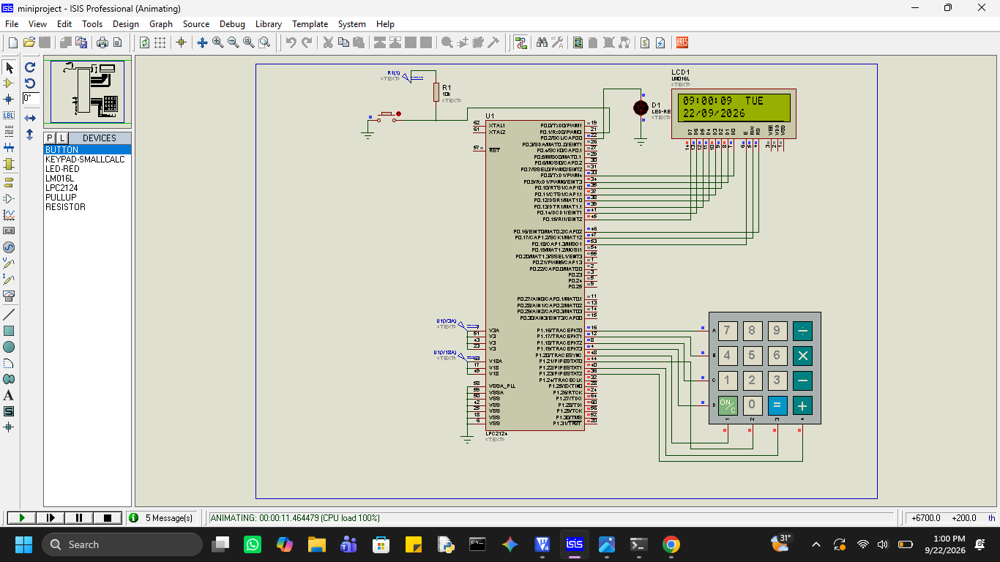

# LPC2148 Menu-Driven RTC Configuration and Scheduled Device Control System

## Project Overview

This project is a menu-driven embedded system developed using the
LPC2148 ARM7 microcontroller.

The system uses the Real-Time Clock (RTC) to maintain date and time.
A 4×4 matrix keypad is used to configure RTC parameters and device
ON/OFF schedule.

A configuration switch connected to EINT0 is used to enter the menu.
The programmed schedule is continuously compared with the current RTC
time, and the LED/device is automatically controlled.

## Features

- RTC time display
- RTC time configuration
- RTC date configuration
- RTC day configuration
- 4×4 matrix keypad input
- Menu-driven operation
- Programmable ON/OFF schedule
- Automatic LED/device control
- EINT0 external interrupt
- Date validation
- Leap-year validation
- Modular Embedded C implementation

## Hardware

- LPC2148 ARM7 Microcontroller
- 16×2 LCD
- 4×4 Matrix Keypad
- LED
- Configuration Switch
- RTC

## Software Tools

- Keil µVision
- Embedded C
- Proteus

## Main Menu
1. RTC
2. SCH
3. EXIT
     ##RTC Menu
1. TIME
2. DATE
3. DAY
4. BACK

## Project Flow

When the system is powered ON, the LPC2148 initializes the RTC, LCD, 4×4 keypad, LED output, and EINT0 external interrupt. The RTC maintains the current date and time, which is continuously displayed on the LCD.

During the main loop, the controller reads the current RTC time and checks it against the programmed ON and OFF schedule. Based on the schedule, the LED/device is automatically turned ON or OFF.

When the configuration switch connected to EINT0 is pressed, an external interrupt is generated. The EINT0 interrupt service routine sets the `menu_request` flag and clears the interrupt. The main loop then detects this flag and opens the main menu.

The main menu provides three options: RTC, Schedule, and Exit. The RTC option opens a submenu for configuring Time, Date, or Day. The Schedule option allows the user to configure the device ON and OFF times. The Exit option returns the system to normal RTC display and automatic schedule control.

## Circuit Diagram

## Modules

| Module | Purpose |
|---|---|
| `output.c` | Main application, menu and EINT0 |
| `LCD.c` | LCD driver |
| `KPM.c` | Keypad driver |
| `RTCLOCK.c` | RTC driver |
| `schedule.c` | Schedule management |
| `delay.c` | Delay functions |
| `Startup.s` | ARM startup code |

## Author

**Sudheer Nandipati**
