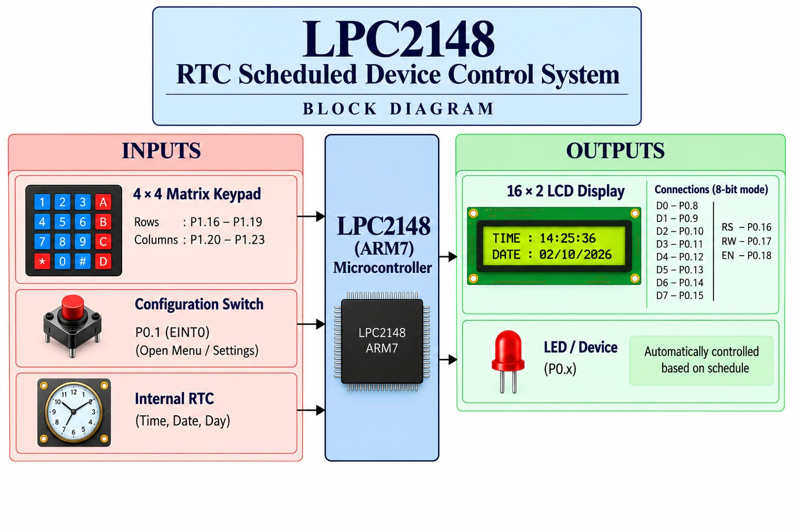
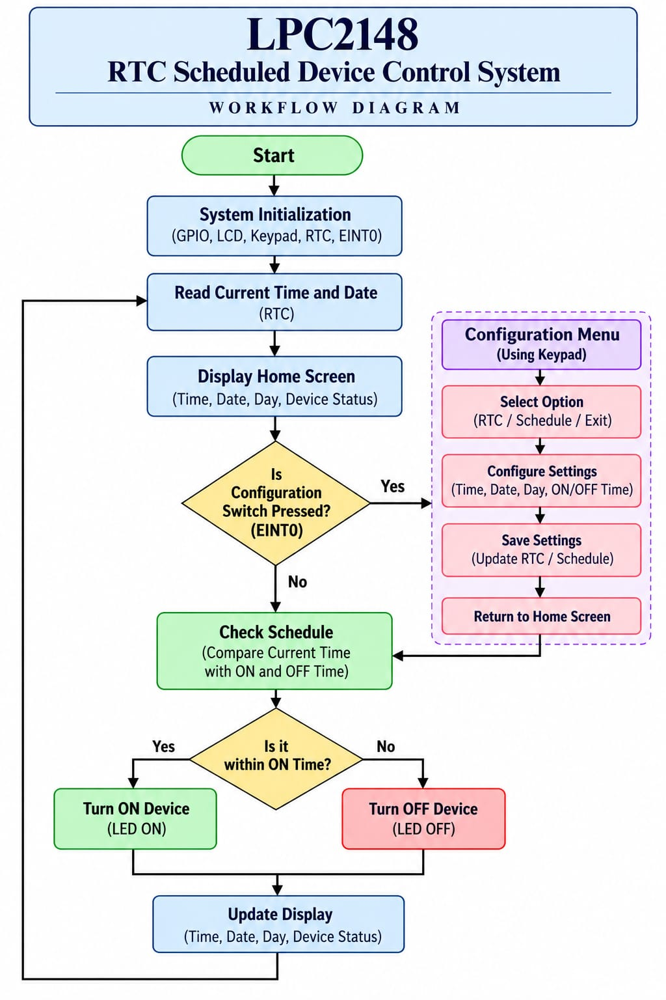
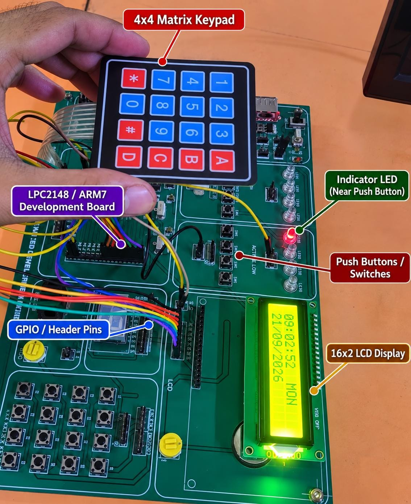
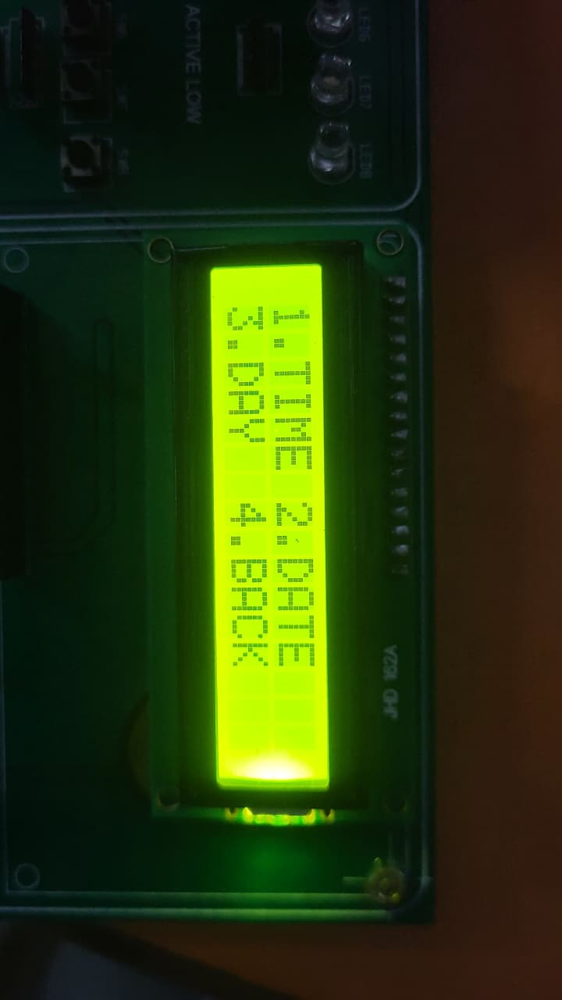
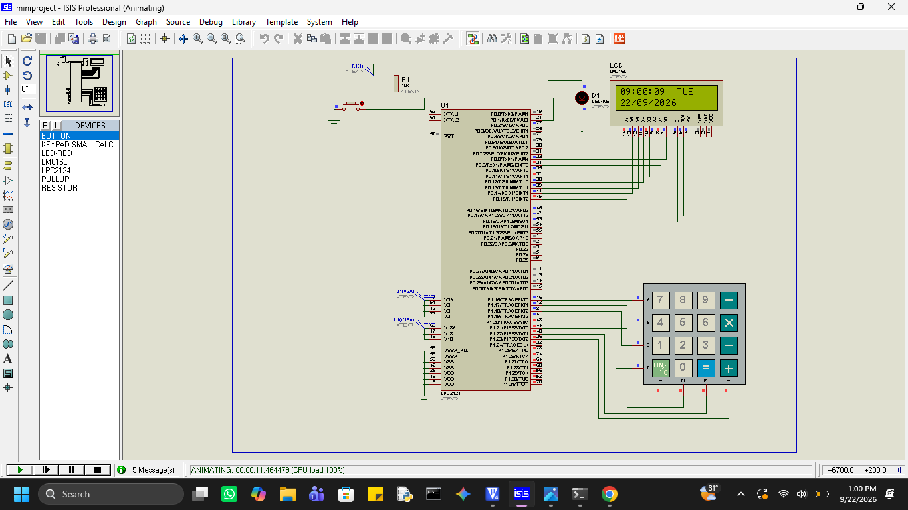

# 🔧 LPC2148 Menu-Driven RTC Configuration and Scheduled Device Control System

## 📌 Overview

This project is a menu-driven Embedded Systems application developed using the **LPC2148 ARM7 microcontroller** and **Embedded C**.

The system uses the LPC2148 internal **Real-Time Clock (RTC)** to maintain the current time, date and day. A **16×2 LCD** displays the information, while a **4×4 matrix keypad** is used for user input and configuration.

A configuration switch connected to **EINT0** is used to enter the configuration menu.

The user can configure:

- ⏰ RTC Time
- 📅 RTC Date
- 🗓️ RTC Day
- 🟢 Device ON Time
- 🔴 Device OFF Time

The system continuously compares the current RTC time with the programmed schedule and automatically controls the connected **LED/device**.

---

## 🎯 Objective

The main objective of this project is to develop a simple time-based device control system using the LPC2148 microcontroller.

The project combines:

- ⏰ RTC-based time management
- 📋 Menu-driven configuration
- ⌨️ Keypad-based user interaction
- 🔘 External interrupt-based menu access
- ⚙️ Programmable ON/OFF scheduling
- 💡 Automatic device control
- 📅 Date and time validation
- 🧩 Modular Embedded C implementation

---

## ⚙️ Key Features

| Feature | Description |
|---|---|
| ⏰ RTC Clock | Maintains current time and date |
| 📺 LCD Display | Displays time, date, day and menu information |
| ⌨️ Keypad | Provides user input and configuration |
| 🔘 EINT0 | Opens the configuration menu |
| ⚙️ Schedule | Allows ON/OFF time configuration |
| 💡 Device Control | Automatically controls the LED/device |
| 🌙 Midnight Schedule | Supports schedules crossing midnight |
| 📅 Date Validation | Checks valid dates |
| 🗓️ Leap-Year Validation | Handles February 29 correctly |
| 🧩 Modular Design | Uses separate application and driver modules |

---

## 🧰 Hardware

- 🔧 LPC2148 ARM7 Microcontroller
- 📺 16×2 LCD
- ⌨️ 4×4 Matrix Keypad
- 💡 LED / Device
- 🔘 Configuration Switch
- ⏰ Internal RTC
- 🎛️ 10K Potentiometer
- 🔩 330Ω Resistor
- 🔌 Power Supply

---

## 💻 Software Tools

- 🛠️ Keil µVision
- 💻 Embedded C
- 🧪 Proteus

---

## 🧠 System Architecture

The **LPC2148** acts as the main controller of the system.

### Inputs

- ⏰ Internal RTC
- ⌨️ 4×4 Matrix Keypad
- 🔘 EINT0 Configuration Switch

### Outputs

- 📺 16×2 LCD
- 💡 LED / Device

### Overall Working Flow

```text
RTC
 ↓
Current Time
 ↓
Schedule Comparison
 ↓
LED / Device ON or OFF
```

### Configuration Flow

```text
Configuration Switch
        ↓
      EINT0
        ↓
Configuration Menu
        ↓
   Keypad Input
        ↓
RTC / Schedule Settings
        ↓
Normal Operation
```

---

## 🖼️ Block Diagram



---
## 🔄 Workflow Diagram

The following workflow shows the complete operation of the LPC2148 RTC Scheduled Device Control System.



## 🔌 Hardware Connections

### 📺 LCD Interface

The 16×2 LCD is connected in **8-bit mode**.

| LCD Signal | LPC2148 Connection |
|---|---|
| D0 | P0.8 |
| D1 | P0.9 |
| D2 | P0.10 |
| D3 | P0.11 |
| D4 | P0.12 |
| D5 | P0.13 |
| D6 | P0.14 |
| D7 | P0.15 |
| RS | P0.16 |
| RW | P0.17 |
| EN | P0.18 |

The LCD is used to display:

- Current time
- Current date
- Day
- Menu options
- Schedule information
- Status messages

### ⌨️ 4×4 Matrix Keypad

The keypad is used for:

- Menu selection
- Numeric input
- RTC configuration
- Schedule configuration
- Menu navigation

The keypad uses row-column scanning to detect the pressed key.

### 🔘 Configuration Switch

| Device | LPC2148 Pin | Function |
|---|---|---|
| Configuration Switch | P0.1 | EINT0 menu request |

When the switch is pressed, an external interrupt is generated. The interrupt sets the `menu_request` flag, and the main program handles the menu operation.

---

## 📷 Hardware Setup

<p align="center">
  
</p>

## 📺 LCD Setup

<p align="center">
  
</p>

---

## ⏰ RTC Management

The LPC2148 internal RTC maintains:

- Hour
- Minute
- Second
- Date
- Month
- Year
- Day of week

### Valid Time Range

| Parameter | Valid Range |
|---|---|
| Hour | 0–23 |
| Minute | 0–59 |
| Second | 0–59 |
| Month | 1–12 |

The system validates the entered values before updating the RTC.

---

## 📋 Menu System

### Main Menu

```text
1. RTC
2. SCH
3. EXIT
```

### RTC Menu

```text
1. TIME
2. DATE
3. DAY
4. BACK
```

### Time Menu

```text
1. HR
2. MIN
3. SEC
4. BACK
```

The user can separately configure:

- Hour
- Minute
- Second

### Date Menu

```text
1. DATE
2. MONTH
3. YEAR
4. BACK
```

The user can separately configure:

- Date
- Month
- Year

### Day Menu

```text
0S 1M 2T 3W
4T 5F 6S 7B
```

```text
0 → Sunday
1 → Monday
2 → Tuesday
3 → Wednesday
4 → Thursday
5 → Friday
6 → Saturday
7 → Back
```

### Schedule Menu

```text
1. ON
2. OFF
3. BACK
```

The ON and OFF times can be configured separately.

---

## ⚙️ Schedule Management

The user can configure:

```text
ON Time
OFF Time
```

The current RTC time is continuously compared with the programmed schedule.

### 🟢 Normal Schedule

Example:

```text
ON  = 09:00
OFF = 17:00
```

Expected operation:

```text
08:59 → OFF
09:00 → ON
12:00 → ON
16:59 → ON
17:00 → OFF
```

The ON time is included and the OFF time is excluded.

### 🌙 Midnight-Crossing Schedule

The system also supports schedules where the ON time is later than the OFF time.

Example:

```text
ON  = 22:00
OFF = 06:00
```

Expected operation:

```text
21:59 → OFF
22:00 → ON
23:59 → ON
00:00 → ON
05:59 → ON
06:00 → OFF
```

This allows the device to operate across midnight.

### 🚫 Same ON/OFF Time

If:

```text
ON  = 09:00
OFF = 09:00
```

the schedule is rejected because both times are identical.

---

## 🛡️ Input Validation

The project validates important user inputs before accepting them.

### Time Validation

```text
Hour   : 0–23
Minute : 0–59
Second : 0–59
```

### Date Validation

The system checks the valid number of days according to the selected month.

Examples:

```text
30/04       → Valid
31/04       → Invalid
28/02       → Valid
29/02/2028  → Valid
29/02/2027  → Invalid
```

### 🗓️ Leap-Year Validation

The project checks leap years before accepting February 29.

```c
(year % 400 == 0) ||
((year % 4 == 0) && (year % 100 != 0))
```

---

## 🔘 EINT0 External Interrupt

The configuration switch is connected to:

```text
P0.1 → EINT0
```

When the switch is pressed:

```text
Configuration Switch
        ↓
      EINT0
        ↓
       ISR
        ↓
menu_request = 1
        ↓
Clear Interrupt
        ↓
Main Program
        ↓
Configuration Menu
```

The ISR only handles the interrupt request. The main program performs the menu and keypad operations.

This keeps the interrupt service routine short and simple.

---

## 🔄 Working Principle

1. The LPC2148 initializes the required peripherals.
2. The RTC maintains the current time and date.
3. The LCD displays the current RTC information.
4. The main loop reads the current RTC time.
5. The schedule is checked continuously.
6. The LED/device is turned ON or OFF according to the schedule.
7. When the EINT0 switch is pressed, an interrupt is generated.
8. The EINT0 ISR sets the `menu_request` flag.
9. The main program detects the flag and opens the menu.
10. The user configures the RTC or schedule using the keypad.
11. After configuration, the system returns to normal operation.

---

## 🔄 Main Program Flow

```text
Initialize Peripherals
        ↓
Read RTC
        ↓
Display Time and Date
        ↓
Check Schedule
        ↓
Control LED / Device
        ↓
Check EINT0 Request
        ↓
Open Menu if Requested
        ↓
Configure RTC / Schedule
        ↓
Return to Normal Operation
```

---

## 🧩 Software Modules

| Module | Responsibility |
|---|---|
| `output.c` | Main application, menu and EINT0 handling |
| `LCD.c` | LCD interface and display operations |
| `KPM.c` | Keypad scanning and numeric input |
| `RTCLOCK.c` | RTC initialization and time/date handling |
| `schedule.c` | ON/OFF schedule processing |
| `delay.c` | Delay functions |

---

## 📁 Project Structure

```text
LPC2148-RTC-Scheduled-Device-Control/
│
├── Source/
│   ├── output.c
│   ├── LCD.c
│   ├── LCD.h
│   ├── lcd_defines.h
│   ├── KPM.c
│   ├── kpm.h
│   ├── KPM_defines.h
│   ├── RTCLOCK.c
│   ├── rtclock.h
│   ├── schedule.c
│   ├── schedule.h
│   ├── delay.c
│   └── delay.h
│
├── Proteus/
│   ├── LPC2148_Circuit.png
│   └── mini project.jpeg
│
├── Hardware/
│   ├── Hardware_Setup.jpeg
│   └── LCD.jpeg
│
└── README.md
```

---

## 🧪 Testing

| Test Case | Expected Result |
|---|---|
| Valid time | Accepted |
| Invalid hour | Rejected |
| Invalid minute | Rejected |
| Valid date | Accepted |
| Invalid date | Rejected |
| Leap-year date | Accepted when valid |
| Normal schedule | Device operates correctly |
| Midnight schedule | Device operates across midnight |
| Same ON/OFF time | Schedule rejected |
| EINT0 switch | Configuration menu opens |
| RTC BACK | Returns to Main Menu |
| Time BACK | Returns to RTC Menu |
| Date BACK | Returns to RTC Menu |
| Day BACK | Returns to RTC Menu |

---

## 🧪 Proteus Simulation



The project can be tested using Proteus.

### Simulation Steps

1. Open the project in Keil µVision.
2. Build the project.
3. Generate the HEX file.
4. Open the Proteus circuit.
5. Load the HEX file into LPC2148.
6. Start the simulation.
7. Test the LCD, keypad, RTC, switch and LED/device.
8. Configure the RTC and schedule.
9. Verify automatic device control.

---

## 📊 Project Demonstration

The project demonstrates:

- ⏰ RTC time and date display
- 📋 Menu-based configuration
- ⌨️ Keypad-based input
- 🔘 EINT0-based menu access
- ⚙️ ON/OFF schedule configuration
- 💡 Automatic LED/device control
- 🌙 Midnight-crossing schedule
- 📅 Date validation
- 🗓️ Leap-year validation
- 🧪 Proteus simulation

---

## 📸 Project Images

### 🔌 Hardware Setup


### 📺 LCD Interface


### 🧪 Proteus Circuit


### 🏗️ Project Block Diagram


---

## 🛠️ Technologies Used

| Category | Technology |
|---|---|
| Microcontroller | LPC2148 ARM7 |
| Programming | Embedded C |
| Display | 16×2 LCD |
| Input | 4×4 Matrix Keypad |
| Time Management | LPC2148 Internal RTC |
| Interrupt | EINT0 |
| Output | LED / Device |
| Development | Keil µVision |
| Simulation | Proteus |

---

## 🚀 Future Improvements

The project can be extended with:

- 📅 Multiple ON/OFF schedules
- 🗓️ Weekday-based scheduling
- 💾 EEPROM/Flash-based schedule storage
- 📡 UART-based configuration
- 🔐 Password protection
- 🔌 Relay-based appliance control
- 📱 Remote monitoring
- 📊 Event logging

---

## 🎓 Learning Outcomes

This project provided practical experience with:

- Embedded C programming
- ARM7 / LPC2148 programming
- GPIO configuration
- RTC programming
- LCD interfacing
- Matrix keypad interfacing
- External interrupt handling
- Schedule-based device control
- Date and time validation
- Hardware/software integration
- Keil µVision
- Proteus simulation

---

## ⭐ Project Summary

The **LPC2148 Menu-Driven RTC Configuration and Scheduled Device Control System** demonstrates how an ARM7 microcontroller can maintain real-time information, accept user settings, and automatically control a device based on a programmed schedule.

The project combines **RTC, LCD, keypad, GPIO, EINT0, Embedded C and scheduled device control** into a practical Embedded Systems application.

---

## 👨‍💻 Author

**Sudheer Nandipati**

🔧 Embedded Systems | 💻 Embedded C | ⚙️ ARM7 | 🔌 Firmware
